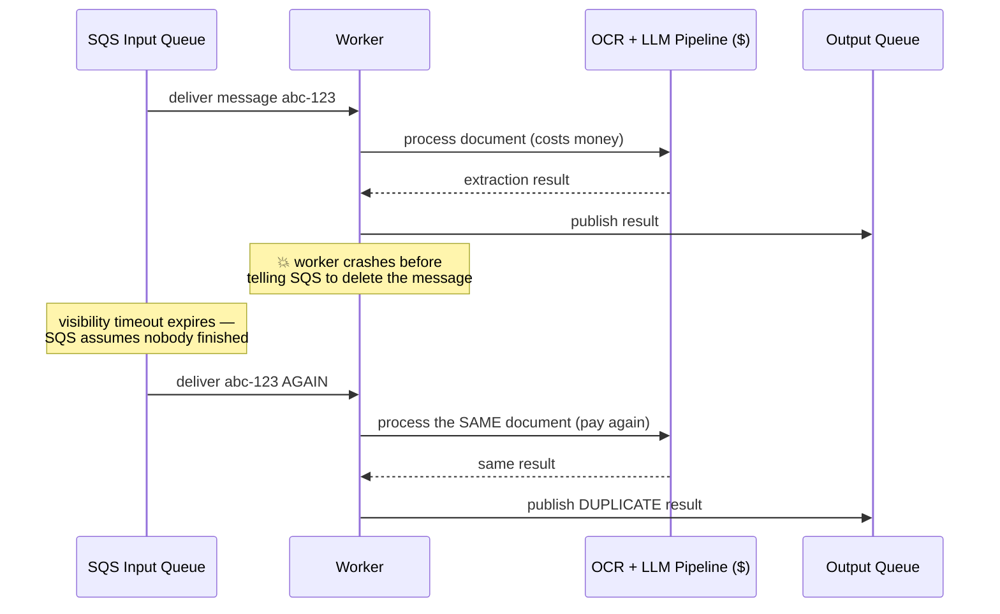
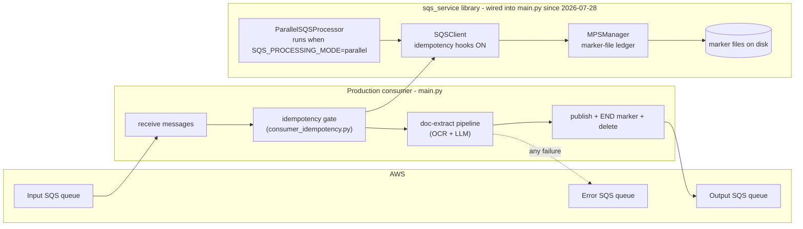
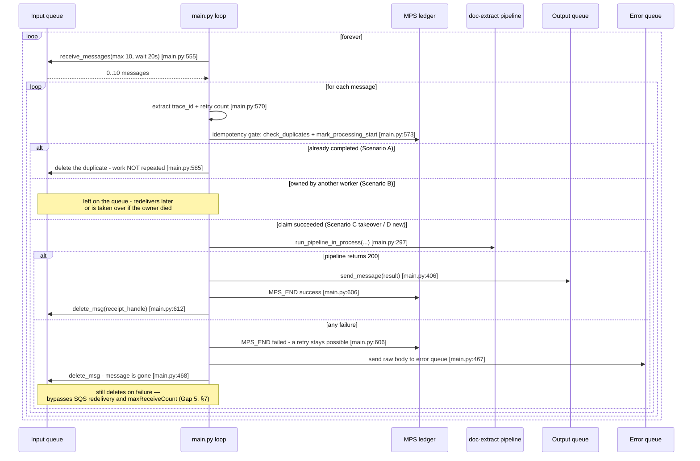
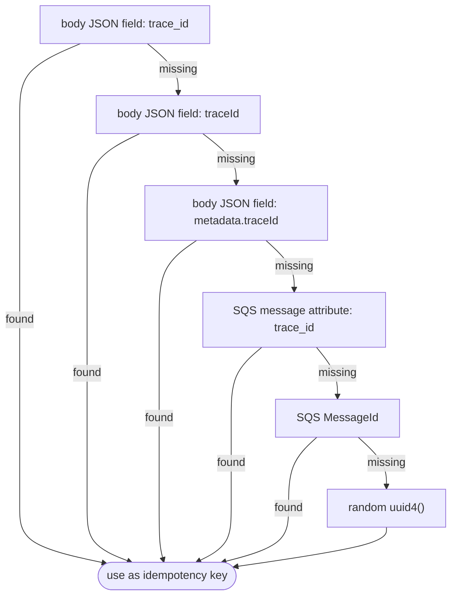
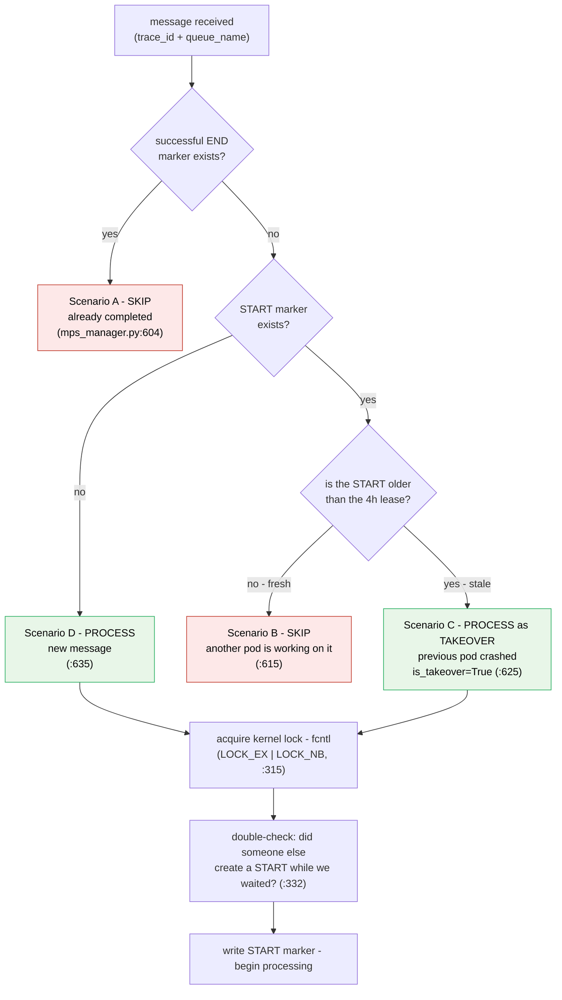
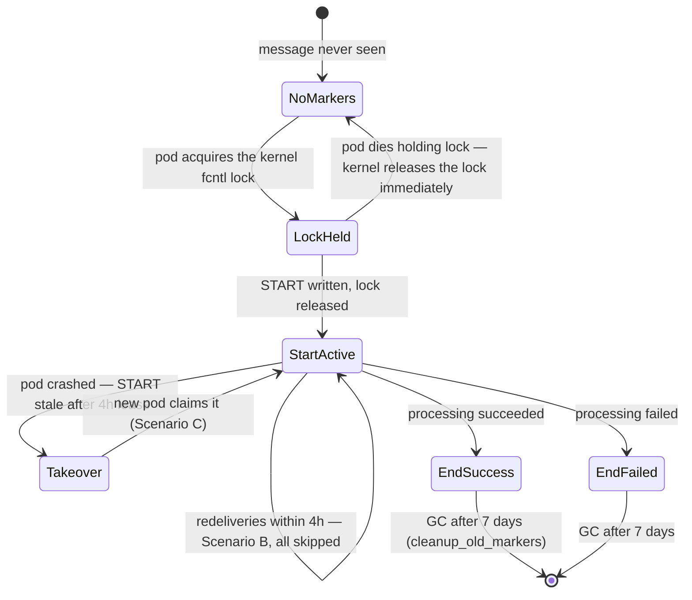
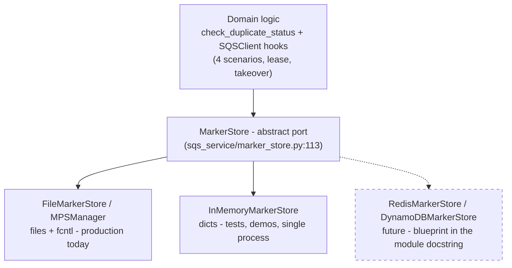
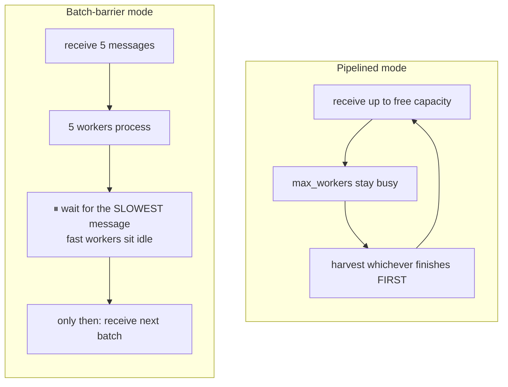
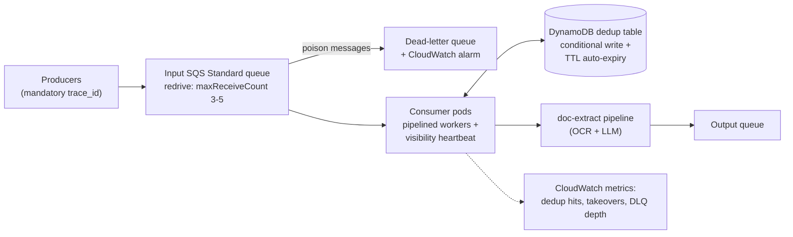

# Idempotent SQS Message Processing — System Documentation

**Repo:** `SQS/` (`cdi-docextract-py-service` SQS layer) · **Date:** 2026-07-28 · **Status of this doc:** current as of the code on this date

**Audience:** management, engineering, and external reviewers (Codex / business team).

> **How to read this document**
>
> - **Management / business:** read §1–§3 (no code knowledge needed), then §7 (status) and §9 (roadmap). ~10 minutes.
> - **Engineers / reviewers:** read everything. Every technical claim carries a `file.py:line` reference so it can be verified against the source, and every behavioral claim in §5 names the automated test that proves it.

## Table of contents

1. [Executive summary](#1-executive-summary)
2. [The problem: one message, delivered twice](#2-the-problem-one-message-delivered-twice)
3. [Idempotency, explained simply](#3-idempotency-explained-simply)
4. [How the system works today](#4-how-the-system-works-today)
5. [Inside the idempotency library (MPS)](#5-inside-the-idempotency-library-mps)
6. [Parallel processing options](#6-parallel-processing-options)
7. [Current status: built vs. wired](#7-current-status-built-vs-wired)
8. [Industry best practices and gap analysis](#8-industry-best-practices-and-gap-analysis)
9. [Recommended roadmap](#9-recommended-roadmap)
10. [Live demo script (5 minutes, no AWS account needed)](#10-live-demo-script-5-minutes-no-aws-account-needed)
11. [Appendices](#11-appendices)

---

## 1. Executive summary

This service consumes document-extraction jobs from an **AWS SQS queue** and runs each document through an **OCR + LLM pipeline** — OCR (optical character recognition) reads the text out of a scanned document, and an LLM (large language model) extracts structured data from that text — then publishes the result to a downstream queue. (SQS is Amazon's *Simple Queue Service*: a managed message queue — think of it as a courier that hands work items to our software.) SQS Standard queues guarantee **at-least-once delivery**: the same message can — and in normal operation occasionally will — be delivered **more than once**. Without protection, every duplicate delivery means paying for the OCR and LLM work a second time and emitting a duplicate result downstream, which matters doubly in a regulated healthcare pipeline.

The protection against this is called **idempotency**: making it safe to receive the same message twice by recognizing and skipping the repeat. This repository contains a complete, tested idempotency library (the **MPS** — Message Processing State — marker system, §5) and a complete, tested parallel-processing library (§6).

**Current status in one line:** *the libraries are built, covered by 122 automated tests (115 pass locally, 7 require live AWS and are skipped) — and as of 2026-07-28 the consumer switches them on: idempotency is wired into `main.py`, and serial vs. parallel consumption is a configuration choice.*

| Capability | Built | Tested | Running in production |
|---|---|---|---|
| SQS client (send / receive / delete, retries, batching) | ✅ | ✅ | ✅ (used by `main.py`) |
| Idempotency (MPS duplicate suppression) | ✅ | ✅ 18 MPS tests + lifecycle + 10 wiring tests | ✅ wired 2026-07-28 (`main.py:508-513`) |
| Parallel processing (5 modes incl. pipelined) | ✅ | ✅ 19 tests | ✅ config-selectable (`SQS_PROCESSING_MODE=parallel`; serial is the default) |
| Pluggable storage backends (MarkerStore port) | ✅ | ✅ 31 contract + factory tests | ➖ file backend is the production default |

**The ask:** the first roadmap step — switching on idempotency in the consumer — is **done**. Approve the remaining phases in §9: (1) deploy the daily marker-cleanup CronJob (entrypoint shipped, spec in the README), (2) add a dead-letter queue (a **DLQ**: a holding queue where repeatedly-failing messages are parked for inspection instead of being retried forever), and (3) move the duplicate-ledger to DynamoDB (an AWS-managed database that every pod can reach — a *pod* being one running copy of this service; several run side by side for capacity). Each phase is independently shippable.

---

## 2. The problem: one message, delivered twice

### Why duplicates happen (and why they are not a bug)

AWS SQS Standard queues promise that every message is delivered **at least once** — not **exactly once**. The queue would rather show you a message twice than risk losing it. Three everyday situations produce duplicates:

1. **Slow processing.** When a consumer receives a message, SQS hides it from other consumers for a period called the **visibility timeout**. If processing takes longer than that window, SQS assumes the consumer died and delivers the message again — while the first consumer is still working on it.
2. **Producer retry.** The sender's network call times out *after* the message was actually stored; the sender retries and now the queue holds two copies.
3. **Crash before delete (the classic).** The consumer finishes the work but crashes *before* telling SQS to delete the message. SQS never learned the work was done, so it redelivers.

The third case is the most important one to internalize: **everything worked correctly, and we still get a duplicate**. This is illustrated below with a real message from this system, identified by `trace_id: abc-123` — the `trace_id` is the unique serial number the sender stamps inside every message.



### What a duplicate costs this business

- **Direct spend:** a second full OCR + LLM run for the same document.
- **Duplicate downstream messages:** the output queue receives the same extraction twice, and every consumer after us must now cope with that.
- **Audit confusion:** in a regulated healthcare pipeline, two processing records for one document raise questions during audits.

The fix is **not** to try to make delivery exactly-once (§8.7 explains why that is impossible in general) — the fix is to make *receiving a duplicate harmless*. That property is idempotency.

---

## 3. Idempotency, explained simply

### The "Pay Now" button

You buy something online. You click **Pay Now**, the spinner hangs, and — like everyone — you click it again. A well-built payment system charges you **once**, not twice. How? Before charging, it checks a ledger: *"have I already seen this exact order?"* The second click is recognized as a **repeat of the same order**, not a new order, and is quietly ignored.

That property — *doing the operation twice has the same effect as doing it once* — is called **idempotency**. Another everyday example: an elevator call button. Pressing it five times doesn't summon five elevators; presses two through five change nothing.

### The same idea, translated to SQS — in three steps

1. **SQS is a courier that sometimes delivers the same envelope twice.** That is the at-least-once contract from §2 — it is by design, not a malfunction.
2. **Our worker is the cashier.** If the same "process document abc-123" slip arrives twice and the cashier blindly obeys both, we pay for the OCR/LLM work twice and ship two results.
3. **The fix is a ledger.** Before working, the cashier writes the slip's serial number in a ledger ("started abc-123"); after finishing, marks it done ("finished abc-123"). When a slip arrives, the cashier checks the ledger *first*. Repeat slip → recognized → skipped. **Charged once, even though delivered twice.**

| Payment world | SQS world | This repository |
|---|---|---|
| Order number on the payment slip | Unique ID inside the message | `trace_id` (plus queue name) |
| The cashier's ledger | Duplicate-tracking store | **MPS marker files** managed by `MPSManager` (§5) |
| "Already charged — ignore the repeat" | "Already processed — skip the redelivery" | END marker found → **Scenario A: skip** (§5) |

One more piece of vocabulary and the whole design falls into place: the ledger has **two** kinds of entries, not one. *"I have started working on this"* (so two workers don't grab the same message simultaneously) and *"I have finished this"* (so a redelivery tomorrow is still recognized). In this repo those are the **START** and **END** markers.

> **The industry one-liner** (expanded in §8.7): *exactly-once delivery is a myth; at-least-once delivery combined with an idempotent consumer is the standard, textbook pattern.* What this repo implements is not a workaround — it is the recommended architecture.

---

## 4. How the system works today

### 4.1 Components

Three library modules, the consumer wiring module (`consumer_idempotency.py`), the consumer application (`main.py`), and a GC entrypoint (`cleanup_markers.py`). Since **2026-07-28** the consumer is wired to the library: the idempotency gate runs on every message, and the processing mode (serial or pipelined-parallel) is selected by the `SQS_PROCESSING_MODE` environment variable.



| File | Role |
|---|---|
| `sqs_service/sqs_idempotent_processor.py` | `SQSClient` — send/receive/delete with retrying publish/delete helpers and AWS-limit chunking, plus *optional* idempotency hooks (off by default; the input consumer turns them on) and structured lifecycle logging |
| `sqs_service/mps_manager.py` | `MPSManager` — the marker-file ledger (§5) |
| `sqs_service/sqs_parallel_processor.py` | `ParallelSQSProcessor` — 5 parallel consumption modes (§6) |
| `consumer_idempotency.py` | The idempotent-consumption wiring `main.py` runs — kept outside `main.py` so it is importable and unit-testable locally (`main.py` needs client-environment-only modules) |
| `main.py` | The production consumer: serial loop by default, pipelined-parallel via config, feeding the doc-extract pipeline |
| `cleanup_markers.py` | CronJob entrypoint for the marker garbage collection (§5.3) |

### 4.2 The production loop, step by step

The PROD path (`main.py:481-623`; there is also a Kafka branch selected by `INPUT_QUEUE_TYPE`, `main.py:625`, and a TEST mode that posts one generated message and polls it back, `main.py:488-499`). Since 2026-07-28 every message passes through the **idempotency gate** before the pipeline runs:



Key facts about this loop, each verifiable in the source:

- **Idempotency is ON for the input consumer.** The input client is constructed with `enable_idempotency=True, mps_storage_path=Constant.SQS_MPS_PATH` (`main.py:508-513`). The wiring logic itself lives in `consumer_idempotency.py` — importable and unit-tested (`test/test_consumer_wiring.py`, 10 tests) because `main.py` cannot be imported outside the client environment. The module-level output/error clients stay plain senders — publishing needs no markers (`main.py:57-65`).
- **Serial by default, parallel by config.** `SQS_PROCESSING_MODE=serial` (default) runs the per-message loop above (`main.py:552-614`); `parallel` runs the same gate + lifecycle inside `process_pipelined_with_threads` with `SQS_MAX_WORKERS` workers (`main.py:523-549`, handler built by `make_idempotent_handler`, `consumer_idempotency.py:140`). An unrecognized mode fails fast at startup (`main.py:515-521`).
- **The lifecycle order is the prescribed one:** publish (inside `process_sqs_message`) → `MPS_END` → delete. A failed END also clears the START lease, so a failed message retries immediately instead of waiting out the 4-hour lease.
- **The gate fails open.** If the marker layer itself errors (e.g. the volume is unavailable), the message is processed normally with a logged warning (`idempotency_gate`, `consumer_idempotency.py:93-121`) — duplicate protection can degrade, but it can never stop consumption.
- **Failure handling still deletes immediately.** On processing failure the raw body is copied to the error queue and the original is deleted (`_route_to_error_queue`, `main.py:456-478`). The message never gets SQS's free automatic retry — unchanged by this wiring and still Gap 5 (§7): the DLQ + redrive decision (P2) supersedes it. Only if the error-queue post — or the subsequent input-queue delete — fails does the message stay for redelivery.
- **The loop is crash-resistant.** Unexpected exceptions log and sleep 5 s rather than killing the pod (`main.py:620-623`).
- The client layer provides 256 KB message-size validation (`:302`) and automatic chunking of batch calls to AWS's 10-entry limit (`send_message_batch` `:517`, `delete_msg_batch` `:742`). Retrying publish/delete helpers with 1 s / 3 s backoff also exist (`_publish_with_retry` `sqs_idempotent_processor.py:943`, `_delete_with_retry` `:1010`) but **currently have no production callers** — the loop uses the non-retrying send/delete paths.

### 4.3 Where the idempotency key comes from

Everything in §5 keys off a **`trace_id`**. `SQSMessage.from_sqs_response` (`sqs_idempotent_processor.py:160-211`) resolves it with a six-step fallback chain:



The first four steps are good: they use an ID chosen by the *producer*, which stays identical across redeliveries. The last two are safety fallbacks with a real caveat — a producer-side resend gets a new `MessageId`, and `uuid4()` is different every time, so **messages that reach the fallbacks are effectively exempt from deduplication**. §8.1 covers the industry-standard fix (make the business key mandatory).

Supporting plumbing worth knowing exists: thread-local **MDC logging context** and lifecycle markers `MESSAGE_START / MESSAGE_SUCCESS / MESSAGE_FAILED / MESSAGE_END` (`sqs_idempotent_processor.py:66-138`) for log correlation, and a typed exception family — `ProcessingError(should_retry=True)`, `ValidationError(should_retry=False)`, `ProcessingTimeoutError`, `PublishError` (`:231-266`) — that already encodes the retryable-vs-permanent distinction (used again in §8.4).

---

## 5. Inside the idempotency library (MPS)

**MPS = Message Processing State** (`mps_manager.py:1-10`). It is the "cashier's ledger" from §3, implemented as small files on disk — one file per ledger entry. The ledger key is **`trace_id` + `queue_name`**, so the same document tracked on two different queues gets two independent entries.

### 5.1 The ledger entries: marker files

Anatomy of a real marker filename (`_build_filename`, `mps_manager.py:94-118`; separator `__`, `:69`):

```
abc-123__doc-extract-input__start__0__1785146400.0
└─────┘  └───────────────┘  └───┘  └┘ └──────────┘
trace_id    queue name       type  retry  unix timestamp
```

| Marker | Filename example | File content | Meaning |
|---|---|---|---|
| **START** | `abc-123__doc-extract-input__start__0__1785146400.0` | empty (`mps_manager.py:348-349`) | "I am working on this message" — an ownership claim |
| **END** | `abc-123__doc-extract-input__end__0__1785146692.0` | `"success"` or `"failed"` (`:434`) | "This message is done" — the permanent dedup record |
| **lock** | `abc-123__doc-extract-input__lock` | empty | Momentary mutex guarding START creation, held as a kernel `fcntl` lock — released automatically by the kernel on crash (`_lock_filepath`, `:246-252`) |

The `retry` segment records SQS's `ApproximateReceiveCount - 1` at processing time (`sqs_idempotent_processor.py:198-201`); the parser tolerates queue names that themselves contain `__` (`_parse_filename`, `mps_manager.py:120-151`). The canonical filename spec with worked write/parse/search examples lives in [CHANGES.md](CHANGES.md) §2.1.

### 5.2 The four-scenario duplicate check

When a message arrives, `check_duplicate_status` (`mps_manager.py:587-638`) consults the ledger and lands in exactly one of four scenarios:



In words:

- **A — already done:** a *successful* END marker exists → skip. A "failed" END does **not** suppress — the message is retried (`has_end_marker`, `mps_manager.py:207-230`). This is the duplicate-delivery suppression from §2/§3.
- **B — someone is on it:** a *fresh* START (younger than the lease) exists → another pod owns this message right now → skip. Prevents two pods double-processing concurrent duplicates.
- **C — crashed-pod takeover:** a *stale* START (older than the 4-hour lease, `timeout_seconds = 4*60*60`, `mps_manager.py:75`) means the owner probably died mid-work → process it, flagged `is_takeover=True`. This is the crash-recovery path.
- **D — brand new:** no markers → process normally.

### 5.3 The race window, closed

"Check, then act" has a classic race: two pods can both check, both see nothing, both start. `create_start_marker` (`mps_manager.py:254-362`) closes it with three mechanisms:

1. **In-process lock registry for threads.** One `threading.Lock` per lock-file path, shared by every `MPSManager` in the process (`_intraprocess_lock_for`, `:43-49`) — needed because fcntl locks never conflict between threads of the same process.
2. **Kernel fcntl lock for pods.** `fcntl.lockf(LOCK_EX | LOCK_NB)` on the per-message lock file (`:315`) — the kernel guarantees exactly one holder, the lock cannot be stolen, and it is released automatically if the holder crashes (on EFS this is an NFSv4 byte-range lock, released when the dead client's lease expires). No lock TTL, no stale-lock stealing; the lock file itself is never unlinked by contenders. The loser backs off (`:316-321`).
3. **Double-check after lock.** The winner re-checks for a live START *after* acquiring the lock (`:330-337`), in case a competitor completed in the gap.

Stale START markers (a crashed pod's claim) are still deleted on sight so takeover can proceed (`_live_start_marker_exists`, `:364-398`), and the lock is always released in a `finally` block (`:354-362`).

Full marker lifecycle including every timeout:



One operational caveat baked into that last transition: `cleanup_old_markers` (`mps_manager.py:494-527`) is the garbage collector for 7-day-old markers and disused lock files (removed only when their fcntl lock is acquirable), but nothing calls it automatically — the CronJob entrypoint exists (`cleanup_markers.py`) and only needs to be scheduled by the infra team (daily Kubernetes CronJob, spec in the README), or the marker directory grows forever. This is Gap 6 in §7 (half-closed). Note also that the GC window *is* the dedup memory: a duplicate arriving 8 days later would be reprocessed.

### 5.4 Worked example E1 — the same message, delivered twice

Message `trace_id = abc-123`, queue `doc-extract-input`. A worker processes it at 10:00:00 and crashes just before deleting; SQS redelivers at 10:05:31.

| Time | Event | Without idempotency (production before 2026-07-28) | With MPS enabled (production today) |
|---|---|---|---|
| 10:00:00 | Delivery #1 arrives | processing starts | ledger checked → Scenario D → `...__start__0__1785146400.0` written → processing starts |
| 10:04:52 | Pipeline finishes, result published | — | `...__end__0__1785146692.0` written containing `success` |
| 10:04:53 | 💥 worker crashes before `delete_msg` | message stays in the queue | message stays in the queue |
| 10:05:31 | Visibility timeout expires → **delivery #2** | **full OCR + LLM re-run, duplicate result published downstream, double cost** | ledger checked → END found → **Scenario A → skipped in milliseconds, zero cost** — worker just deletes the message |

Proven by: `test_full_idempotent_lifecycle` (`test/test_sqs_client_moto.py:203`) — check → start → concurrent start refused → end → duplicate suppressed, against an in-process fake AWS.

### 5.5 Worked example E2 — pod crash and the 4-hour takeover

Pod-1 writes a START for `xyz-789` at 09:00 and is OOM-killed at 09:10, never writing an END.

- **09:15** — SQS redelivers; pod-2 checks the ledger: START is 15 minutes old → within the 4 h lease → **Scenario B, skip** (pod-1 is *assumed* alive; the system cannot tell a slow pod from a dead one).
- **09:15 → 13:00** — every redelivery keeps skipping. The message waits.
- **13:01** — START is now older than the lease → **Scenario C**: pod-2 deletes the stale marker, claims the message with `is_takeover=True`, and processes it. No message is lost.

One asymmetry worth noticing: a Scenario-**A** skip may safely delete the message (the work is provably done), but a Scenario-**B** skip must *leave the message on the queue* — no END marker exists yet, and deleting would lose the work if the owning pod is in fact dead. That is exactly what makes the 13:01 takeover possible.

The trade-off management should understand: **a crashed message waits up to 4 hours before another pod rescues it.** The lease length is a single tunable (`timeout_seconds`, `mps_manager.py:75`) — shorter lease = faster crash recovery but more risk of "taking over" a message from a pod that was merely slow. Proven by: `test_stale_start_marker_allows_takeover` (`test/test_mps_manager.py:120`, which sets the lease to 0 so every START is instantly stale) and `test_second_start_marker_refused` (`:110`) / `test_held_lock_blocks_concurrent_creation` (`:147`) / `test_concurrent_start_creation_single_winner` (`:166`) for the "two pods race" case.

### 5.6 How applications use it: the SQSClient hooks

`SQSClient` exposes the ledger as three calls, all **no-ops unless the client is constructed with `enable_idempotency=True` and an `mps_storage_path`** (constructor validation at `sqs_idempotent_processor.py:396-402`):

| Hook | Does | Source |
|---|---|---|
| `check_duplicates(trace_id)` | "Is there a SUCCESSFUL END marker?" — Scenario A only | `sqs_idempotent_processor.py:1157` |
| `mark_processing_start(trace_id)` | Atomically claim the message (lock + START) | `:1176` |
| `mark_processing_end(trace_id, success=...)` | Write END + emit lifecycle log markers | `:1201` |

For the full four-scenario decision (including B/C takeover semantics) callers use `check_duplicate_status` from `mps_manager` directly. The intended five-stage lifecycle is documented in the module header (`sqs_idempotent_processor.py:7-20`): *poll → duplicate check → START + logging context → process → publish → END → delete* (END must land after the publish side effects but before the delete).

### 5.7 Design caveat to carry into §8: the ledger lives on a filesystem

The algorithm is correct, but the *storage substrate* has a hard operational requirement: with multiple pods, dedup only works if **all pods mount the same volume** (the `fcntl` locking then relies on that shared filesystem honoring POSIX byte-range locks — NFSv4/EFS does). On per-pod local disks, each pod has a private ledger and cross-pod dedup silently does not happen. Every lookup is also a `glob` scan of the whole marker directory (`mps_manager.py:192-193`). The industry-standard fix — same algorithm, different substrate — is a DynamoDB table with conditional writes (§8.2, roadmap P3). Since 2026-07-28 that swap no longer requires touching the domain code at all — see §5.8.

### 5.8 Pluggable storage backends: the MarkerStore port (added 2026-07-28)

The storage substrate is now a **swappable strategy** behind an abstract interface — the *Ports & Adapters* (hexagonal) pattern, the same shape AWS Lambda Powertools uses for its idempotency "persistence layer". This satisfies two SOLID principles directly: the domain logic depends on an abstraction, never a concrete backend (**D**ependency Inversion), and a new backend is added without modifying any existing class (**O**pen/Closed).



The port (`MarkerStore`, `sqs_service/marker_store.py:113`) defines five operations and four guarantees every backend must honor: an **atomic claim** (`create_start_marker` — at most one winner across pods and threads), **lease expiry / takeover**, **success-only suppression** (`has_end_marker`), and **END clears START**. How each guarantee is enforced is the backend's business: files use the fcntl + registry locking of §5.3; Redis would use `SET NX PX` (the TTL *is* the lease); DynamoDB would use conditional writes + a TTL attribute — the exact key schemas and commands are written out as an implementation blueprint in the module docstring, so a future adapter is a fill-in-the-blanks exercise, not a design project.

Three things make this more than a diagram:

- **A second live backend proves substitutability.** `InMemoryMarkerStore` (`marker_store.py:224`) is a real, thread-safe implementation used for tests and demos — not production (state is per-process and lost on restart, which its docstring states loudly).
- **A shared contract test suite** (`test/test_marker_store.py` — see Appendix D) runs the *identical* tests against every backend: single-winner claims under a two-thread race, takeover, failed-END retry, hostile-id rejection, the full four-scenario table. A future Redis/DynamoDB adapter must pass this suite (against fakeredis / moto) before it ships.
- **Injection at the client.** `SQSClient(..., marker_store=<any MarkerStore>)` (`sqs_idempotent_processor.py:335`) overrides the storage strategy without touching the client; the historical `mps_storage_path` path still works. Shared input validation (`_validate_id`, `marker_store.py:127`) rides on the port, so every backend rejects hostile trace_ids identically.

**The backend is chosen by configuration, not code.** The `MPS_BACKEND` environment variable (default `file`; see `.env.example` and `Constant.MPS_BACKEND`, `constant.py:126`) selects the adapter through a factory, `create_marker_store` (`marker_store.py:412`) — the `SQSClient(enable_idempotency=True, mps_storage_path=...)` construction line is identical whichever backend runs. A future adapter registers itself under a config name via `register_marker_store_backend("redis", ...)` (`marker_store.py:398`) and is then live by setting `MPS_BACKEND=redis` — **zero changes to existing code** (Open/Closed, end to end). A typo'd backend name fails loudly at startup listing the registered choices, never silently falling back to different storage than ops intended. Proven by `test_client_backend_swaps_via_config_only` (`test/test_marker_store.py`), which constructs the client twice with identical arguments and gets file storage or memory storage purely from the environment.

---

## 6. Parallel processing options

The consumer's default serial loop handles messages one at a time (§4.2): a batch of 10 takes 10 × (single-document time). Since 2026-07-28 `ParallelSQSProcessor` (`sqs_parallel_processor.py:55`) is wired in behind `SQS_PROCESSING_MODE=parallel` to lift that ceiling. It offers five modes:

| Mode | Method | Concurrency model | Use when |
|---|---|---|---|
| One-shot threads | `process_with_threads` (`:351`) | thread pool, one batch | I/O-bound work, simple batch jobs |
| One-shot processes | `process_with_multiprocessing` (`:406`) | process pool; **all SQS deletes happen in the parent** (`_delete_in_parent`, `:252`); handler must be picklable (checked upfront, `:439-446`) | CPU-bound work |
| One-shot asyncio | `process_with_asyncio` (`:518`) | event loop, semaphore-bounded | async handlers |
| Continuous (barrier) | `continuous_processing_with_threads` (`:626`) | receive batch → process all → repeat | simple long-running consumer |
| **Continuous pipelined** | `process_pipelined_with_threads` (`:684`) | no barrier: refills workers as each finishes (`FIRST_COMPLETED` harvest, `:808`) | **the recommended long-running consumer** |

The difference between the last two is the one that matters for throughput:



*In barrier mode one slow document idles the whole pool; in pipelined mode workers are refilled individually, so throughput tracks average — not worst-case — document time.*

Safety properties of the design (each verified by `test/test_parallel_processor.py`, 19 tests):

- **`delete_on_success=False` is the default** (`:88`): unless you opt in, nothing is ever deleted, and messages redeliver after the visibility timeout. Safe-by-default for experimentation.
- **Receive is capped at `min(max_messages, max_workers)`** (`:197`): the processor never holds messages queued behind busy workers while their visibility timeout burns down.
- **Failure signaling:** the handler fails by *raising* or by returning exactly `False` (module contract, `:10-17`). A failed message is not deleted → SQS redelivers it.
- **Delete-failure ≠ processing-failure:** if the work succeeded but the delete call failed, the result is `{"success": True, "deleted": False, "delete_error": ...}` — the work is not falsely reported as failed (`:923-932`).
- **Graceful shutdown:** pipelined mode drains in-flight messages on stop, bounded by `drain_timeout` (`:827-866`).

Two documented limitations, both feeding §7/§8:

> **No visibility heartbeat.** The processor never calls `ChangeMessageVisibility` to extend the window mid-processing (stated in the module header, `sqs_parallel_processor.py:21-22`). Therefore `visibility_timeout` **must** exceed the worst-case single-message processing time, or SQS will redeliver messages that are still being worked on. §8.5 has the standard fix.
>
> **Contract mismatch with `main.py` — closed in the constructor.** By default the processor calls the handler with the message **Body string** (`_handler_payload`, `:113-117`), but `main.process_sqs_message` expects the **whole message dict** and does `message_body["Body"]` itself (`main.py:216`). Wiring them together with the default would fail on every message — but the `message_arg="message"` constructor option (added 2026-07-27) passes the full dict, and the production parallel branch uses exactly that (`main.py:528-541`; Gap 3, §7 — closed).
>
> **Before first enabling parallel mode in the client environment:** `process_sqs_message` then runs concurrently, and it sets/clears `log_util`'s trace-id and context-map state per message. Verify that `log_util` backs those with `contextvars`/`threading.local` (the `sqs_service` MDC does; `log_util` is client-environment code we cannot inspect here) — if they are plain globals, concurrent messages could log under the **wrong trace_id**, an audit problem in a regulated pipeline. Serial remains the audit-safe default until that is confirmed.

---

## 7. Current status: built vs. wired

**Framing: the library work is complete and tested, and the consumer wiring landed on 2026-07-28.** What remains is infrastructure-level: the DLQ decision, the shared-volume-vs-DynamoDB decision, the visibility heartbeat, and deploying the GC CronJob. Each row below has evidence you can check.

### 7a. Capability status

| Capability | Built | Unit-tested | Wired into prod | Evidence |
|---|---|---|---|---|
| SQS client core (retries, chunking, validation) | ✅ | ✅ | ✅ | `sqs_idempotent_processor.py`; `test/test_sqs_client_moto.py` (24 tests) |
| MPS idempotency ledger | ✅ | ✅ | ✅ 2026-07-28 | `mps_manager.py`; `test/test_mps_manager.py` (18 tests); wiring at `main.py:508-513` |
| Idempotency hooks in the client | ✅ | ✅ | ✅ 2026-07-28 | `sqs_idempotent_processor.py:1157-1255`; `consumer_idempotency.py`; `test/test_consumer_wiring.py` (10 tests) |
| Parallel modes incl. pipelined | ✅ | ✅ | ✅ via config | `sqs_parallel_processor.py`; `test/test_parallel_processor.py` (19 tests); `SQS_PROCESSING_MODE=parallel` at `main.py:523-549` |
| Consumer loop | ✅ | wiring logic locally; loop live env only | ✅ serial default / parallel via config | `main.py:481-623` |
| Marker garbage collection | ✅ code exists | ✅ | ➖ entrypoint shipped; CronJob deployment pending | `cleanup_markers.py`; `mps_manager.py:494`; CronJob spec in README |

### 7b. The six gaps — three closed on 2026-07-28, three remain

| # | Status | Gap | Evidence | Direction |
|---|---|---|---|---|
| 1 | ✅ **Closed 2026-07-28** | ~~Idempotency not enabled in `main.py`~~ — the input client now passes `enable_idempotency=True, mps_storage_path=Constant.SQS_MPS_PATH` and every message runs through the gate | wiring `main.py:508-513, 567-614`; logic `consumer_idempotency.py`; proven by `test/test_consumer_wiring.py` (10 tests) | done (was Roadmap P1) |
| 2 | ✅ **Closed 2026-07-28** | ~~Processing strictly serial~~ — pipelined-parallel is one env var away | `SQS_PROCESSING_MODE=parallel` branch at `main.py:523-549` (serial stays the default) | roll out gradually; watch visibility-timeout sizing (§8.5) |
| 3 | ✅ **Closed 2026-07-28** | ~~Handler contract mismatch~~ — the parallel branch passes the full message dict via `message_arg="message"` and wraps `process_sqs_message` in the idempotent handler | `main.py:528-541`; `make_idempotent_handler`, `consumer_idempotency.py:140` | done |
| 4 | 🔶 Open | **Architecture decisions** from the production-readiness review: DLQ/redrive; visibility heartbeat for multi-minute jobs; markers need a shared volume (DynamoDB recommended); Standard-vs-FIFO; 60 s async purge window | [REVIEW_FINDINGS.md](REVIEW_FINDINGS.md) §3 | **P2/P3/P4** below; each maps to a §8 practice |
| 5 | 🔶 Open | **Failure path deletes immediately** — transient failures (S3 blip, LLM timeout) go to the error queue and the original is deleted; unchanged by the idempotency wiring (a failed END deliberately does not block a retry, but the delete still forfeits it) | `main.py:614`, `:467-468` | DLQ + redrive policy; let retryable errors redeliver (**P2**) |
| 6 | 🔶 Half-closed | **Marker GC** — the entrypoint now exists (`cleanup_markers.py`, needs only `SQS_MPS_PATH`), but the daily CronJob still has to be deployed in the client environment | `cleanup_markers.py`; CronJob spec in README | infra team deploys the CronJob (spec provided) |

The remaining items are infrastructure decisions, not code work — each has a recommended resolution in §8 and a slot in the §9 roadmap.

---

## 8. Industry best practices and gap analysis

The master matrix, then two short paragraphs per row.

| # | Practice | Industry standard | This repo today | Recommendation |
|---|---|---|---|---|
| 8.1 | Idempotency key | producer-supplied deterministic business key (Stripe `Idempotency-Key`) | trace_id fallback chain; falls back to `MessageId`/`uuid4` which defeat dedup | make `trace_id` mandatory at the producer; log/alert on fallback |
| 8.2 | Dedup store | DynamoDB conditional writes + TTL | filesystem markers (needs shared volume) | keep the algorithm, swap the substrate to DynamoDB |
| 8.3 | Prior art | AWS Lambda Powertools idempotency utility | MPS design is nearly isomorphic to it | cite as validation; converge on its storage model |
| 8.4 | Poison messages | DLQ + redrive policy (`maxReceiveCount` 3–5) | custom error queue, immediate delete | add DLQ; stop deleting on transient failure |
| 8.5 | Long processing | visibility heartbeat (`ChangeMessageVisibility`) | none (documented) | heartbeat thread, or size timeout to P99.9 until then |
| 8.6 | FIFO dedup | FIFO `MessageDeduplicationId` where ordering matters | Standard queue (unconfirmed decision) | stay Standard + idempotent consumer unless ordering is required |
| 8.7 | Delivery semantics | at-least-once + idempotent consumer is THE pattern | exactly this design — wired since 2026-07-28 | done (was P1) |
| 8.8 | Observability | metrics on dedup hits, takeovers, DLQ depth | structured logs only | emit counters at the four scenario branches |

**8.1 Idempotency key selection.** The canonical example is Stripe's `Idempotency-Key` header: the *caller* supplies a stable key, and retries of the same logical operation reuse it. This repo does the right thing when producers set `trace_id` in the message body — that value survives redelivery and resends. The weakness is the tail of the fallback chain (§4.3): `MessageId` changes if a producer re-sends, and `uuid4()` is unique per receive, so any message that reaches those fallbacks silently opts out of dedup. Recommendation: treat a missing `trace_id` as a producer contract violation — reject or alarm, don't silently fall back.

**8.2 Dedup store: DynamoDB conditional writes vs. filesystem.** The industry-standard ledger for SQS consumers is a DynamoDB table written with `PutItem` + `ConditionExpression: attribute_not_exists(pk)` — the same "only one writer can win" guarantee the kernel `fcntl` lock provides, but backed by a regional, replicated service that every pod can reach, with a native TTL attribute doing the 7-day GC automatically. The good news: **the hard part of this repo — the four-scenario logic, the lease, the takeover — ports one-to-one** (END item ↔ END marker; item with `status=INPROGRESS` and fresh lease ↔ live START; expired lease ↔ stale START; no item ↔ Scenario D). Keep the `MPSManager` interface, swap the backend (roadmap P3). With the MarkerStore port in place (§5.8), this is now a drop-in adapter rather than a rework — the exact conditional-write + TTL blueprint is written out in `sqs_service/marker_store.py`'s module docstring.

**8.3 Prior art: AWS Lambda Powertools idempotency utility.** AWS's own blessed implementation of this pattern stores an `INPROGRESS` record before invoking your function and a `COMPLETED` record (with the cached result) after, in DynamoDB, with an expiry lease for crash recovery. That is structurally the same design as MPS START/END + the 4-hour lease. For reviewers, this is the key credibility point: **this repo independently arrived at the AWS-recommended architecture; only the storage substrate differs.**

**8.4 DLQ + redrive policy.** The standard poison-message pattern is configured on the queue itself: after `maxReceiveCount` failed receives (3–5 is typical), SQS automatically moves the message to a dead-letter queue, where it sits for inspection with an alarm on queue depth, and can be redriven to the source after a fix. Today this repo substitutes a custom error queue and deletes the original immediately (Gap 5) — which treats a 2-second S3 blip the same as a permanently corrupt message and forfeits SQS's free retries. The codebase *already* distinguishes the two cases (`ProcessingError(should_retry=True)` vs `ValidationError(should_retry=False)`, `sqs_idempotent_processor.py:231-247`) — the delete decision just doesn't consult it yet. Recommendation: transient failure → don't delete, let SQS redeliver; permanent failure → let redrive move it to the DLQ.

**8.5 Visibility-timeout heartbeat.** For jobs that can run minutes (OCR + LLM does), the standard pattern is a background thread that periodically calls `ChangeMessageVisibility` to extend the window while processing is genuinely alive — the message is redelivered quickly if the pod dies (heartbeat stops) but never while work is in progress. This repo deliberately omits it (`sqs_parallel_processor.py:21-22`) and instead requires sizing `visibility_timeout` above worst-case processing time. That's acceptable as an interim rule (size to P99.9), but the heartbeat is the durable fix (P4). Note MPS Scenario B independently limits the damage of a premature redelivery — the duplicate is skipped — which is a good defense-in-depth story.

**8.6 FIFO queues and `MessageDeduplicationId`.** SQS FIFO queues offer producer-side dedup (identical `MessageDeduplicationId` within a 5-minute window is dropped) plus strict ordering, at the cost of per-message-group throughput limits. Two things to understand: the 5-minute window does **not** cover consumer-side redelivery (a crash-before-delete still redelivers, §2), so FIFO does *not* remove the need for an idempotent consumer; and this pipeline has no stated ordering requirement. Recommendation: stay on Standard + idempotent consumer unless a business ordering requirement emerges. The open Standard-vs-FIFO question in REVIEW_FINDINGS.md §3 should be closed with exactly that rationale.

**8.7 The exactly-once myth.** No system can guarantee exactly-once *delivery* end-to-end across process boundaries — an acknowledgment can always be lost after the work happened (that is precisely the crash-before-delete in §2). The industry consensus, reflected in AWS's own documentation, is: choose at-least-once delivery, and make the *consumer* idempotent so duplicates are harmless. **This is exactly what this repo builds.** For management: MPS is not a patch over a flaw — it is the textbook architecture, the same one used by payment processors.

**8.8 Observability.** Once dedup is live, its behavior should be visible: counters for Scenario A/B hits (duplicates suppressed = money saved — this is the metric to show management), Scenario C takeovers (crash-recovery events), lock contention, and marker-directory size; plus CloudWatch alarms on DLQ depth and on dedup-hit *spikes* (a sudden spike usually means an upstream producer started double-sending). The MDC lifecycle log markers (§4.3) give per-message traceability today; the four branch points in `check_duplicate_status` (`mps_manager.py:604,615,625,635`) are the natural place to emit counters.

### Recommended target architecture



Compare with the current-state diagram in §4.1: the consumer wiring is already in place — what changes here is the ledger moving from disk to DynamoDB, the error queue becoming a real DLQ, and the heartbeat protecting long-running documents.

---

## 9. Recommended roadmap

Each phase is independently shippable and cites the gap (§7b) it closes. Effort: S = hours, M = days, L = a sprint.

| Phase | Change | Closes | Effort | Risk |
|---|---|---|---|---|
| **P1** | ✅ **Done 2026-07-28.** Idempotency wired into `main.py` (`consumer_idempotency.py` + `main.py:508-614`, 10 wiring tests); GC entrypoint shipped (`cleanup_markers.py`). Remaining sliver: the infra team deploys the daily CronJob (spec in README). Cross-pod dedup still requires the shared volume (or P3). | Gaps 1, 6 | S | shipped — the gate fails open, so dedup can degrade but never stop consumption |
| **P2** | Replace immediate-delete-on-failure with DLQ + redrive policy on the input queue; honor `should_retry` — transient failures redeliver, poison goes to DLQ | Gap 5, part of 4 | M | low — infra config + one code-path change |
| **P3** | Implement a `DynamoDBMarkerStore` (conditional writes + TTL) against the `MarkerStore` port, following the §5.8 blueprint and passing the shared contract test suite; select it via `MPS_BACKEND` — the four-scenario logic ports 1:1, no domain code changes | Gap 4 (shared-volume decision) | M | medium — new AWS dependency, needs a migration window |
| **P4** | 🔶 **Half-done 2026-07-28:** pipelined consumption shipped behind `SQS_PROCESSING_MODE=parallel` (Gaps 2, 3 closed). Remaining: the visibility heartbeat, and a gradual production rollout of parallel mode | Gaps 2, 3, part of 4 | M | medium — throughput change; roll out gradually |
| **P5** | Dedup/takeover/DLQ metrics + CloudWatch alarms | §8.8 | S | low |

---

## 10. Live demo script (5 minutes, no AWS account needed)

Everything below runs on a laptop against **moto**, an in-process fake AWS — no credentials, no cost, no risk (the test suite even force-fakes AWS credentials so it *cannot* touch a real account, `test/conftest.py`).

```bash
cd /Users/mitulkanani/Desktop/Projects/SQS
source venv/bin/activate
```

**Act 1 — "the ledger works" (~30 s).**

```bash
pytest test/test_mps_manager.py -v
```

18 tests pass in about a second. Call out while the output scrolls:

- `test_second_start_marker_refused` — *"two pods cannot grab the same message"* (Scenario B)
- `test_stale_start_marker_allows_takeover` — *"a crashed pod's work is recovered"* (Scenario C)
- `test_orphaned_lock_does_not_block_forever` — *"a crash can never wedge the system"* (a crashed pod's lock releases instantly — no TTL wait)
- `test_check_duplicate_status_scenarios` — *"all four decision branches behave as documented"*

**Act 2 — "end to end against a fake AWS" (~30 s).**

```bash
pytest test/test_sqs_client_moto.py::test_full_idempotent_lifecycle -v
```

One test tells the whole §5 story: duplicate check comes back clean → worker claims the message → **a second concurrent worker is refused** → work completes, END written → **the duplicate check now suppresses redelivery**.

**Act 3 — "and this is exactly what production runs" (~30 s).**

```bash
pytest test/test_consumer_wiring.py -v
```

10 tests exercising the very module `main.py` executes (`consumer_idempotency.py`): a message delivered twice is processed **once** and both copies deleted; a message owned by another worker is left on the queue; a failed message stays retryable; a broken marker volume degrades protection but never stops consumption; and the parallel handler does all of the same through `ParallelSQSProcessor`.

**Act 4 — the full suite (~6 s).**

```bash
pytest test/ -v
```

Expected final line (counts verified 2026-07-28; the wall-clock time varies run to run):

```
================== 115 passed, 7 skipped, 47 warnings in ~6s ==================
```

Say out loud: *the 7 skips are intentional — those tests talk to real AWS and only run when `RUN_LIVE=1` is set.* (The warnings are a boto3 Python-3.9 deprecation notice and one pytest collection notice — pre-existing, unrelated to correctness.)

**Optional encore — parallel throughput:**

```bash
pytest test/test_parallel_processor.py::test_pipelined_processes_everything_and_stops_gracefully -v
```

25 messages drained by 5 pipelined workers with a graceful stop — the §6 recommended mode, live.

**Optional encore — pluggable storage:**

```bash
pytest test/test_marker_store.py -v
```

The same idempotency contract passing against two storage backends (file and in-memory), plus backend selection purely from config (§5.8).

---

## 11. Appendices

### A. Glossary (plain-language)

| Term | Meaning |
|---|---|
| SQS | Amazon Simple Queue Service — the AWS message queue this service reads jobs from |
| OCR | Optical character recognition — software that reads the text out of a scanned document |
| LLM | Large language model — the AI that extracts structured data from the document text |
| Pod | One running copy of the consumer service (a Kubernetes unit); several pods process the queue side by side |
| At-least-once delivery | The queue guarantees you get every message, but may show you the same one more than once |
| Visibility timeout | How long SQS hides a received message from other consumers before assuming you died and redelivering |
| Receipt handle | The per-delivery token you must present to delete a message |
| Idempotent | Safe to repeat — doing it twice has the same effect as doing it once |
| Idempotency key | The stable ID used to recognize a repeat (here: `trace_id` + queue name) |
| Marker (MPS) | A ledger entry file: START = "working on it", END = "done" |
| Lease | How long a START claim is trusted before the owner is presumed dead (4 h here) |
| Takeover | A new pod claiming a message whose previous owner crashed (Scenario C) |
| DLQ / redrive | Dead-letter queue: where SQS automatically parks messages that keep failing, and the mechanism to send them back after a fix |
| Conditional write | A database write that succeeds only if no record exists yet — the atomic "only one winner" primitive |
| moto | A Python library that fakes AWS in-process, so tests run with zero real AWS calls |

### B. File map

| File | Lines | Role |
|---|---|---|
| `sqs_service/sqs_idempotent_processor.py` | ~1250 | `SQSClient`, `SQSMessage`, MDC logging, exceptions |
| `sqs_service/marker_store.py` | ~500 | `MarkerStore` port, `InMemoryMarkerStore`, config-driven backend factory, Redis/DynamoDB blueprint |
| `sqs_service/mps_manager.py` | ~640 | `MPSManager`, `check_duplicate_status`, the four scenarios |
| `sqs_service/sqs_parallel_processor.py` | ~1120 | `ParallelSQSProcessor`, five modes, `process_messages_parallel` helper |
| `consumer_idempotency.py` | ~185 | The idempotent-consumption wiring `main.py` runs (key extraction, gate, END-safe, parallel handler) — importable and unit-tested |
| `main.py` | ~680 | Production consumer (SQS serial/parallel via config + Kafka branch, TEST mode, idempotency on) |
| `cleanup_markers.py` | ~55 | CronJob entrypoint for marker garbage collection |
| `constant.py` | ~170 | Env-var loading (fails fast at import if required vars missing) |

### C. Configuration knobs

| Knob | Value | Where | Tune when |
|---|---|---|---|
| Lock mechanism | kernel `fcntl` lock, no TTL — released automatically on crash | `mps_manager.py:254` (`create_start_marker`) | never — the kernel handles crashed holders |
| START lease (takeover threshold) | 4 h | `mps_manager.py:75` (`timeout_seconds` ctor arg) | crash recovery feels too slow / too aggressive (§5.5) |
| Marker GC age | 7 days | `mps_manager.py:496` | dedup memory must outlive your longest realistic redelivery |
| Publish/delete retry delays | 1 s, 3 s (then fail) — helpers exist but are not wired into `main.py` today | `sqs_idempotent_processor.py:954, 1024` | AWS-side flakiness patterns change |
| Max message size (client-side validation cap) | 256 KB | `sqs_idempotent_processor.py:302` | deliberate local cap at the SQS default; since 2025 AWS allows up to 1 MiB per message (tiered pricing) — raise only with a queue-config decision |
| Default receive visibility | 300 s | `sqs_idempotent_processor.py:703-707` | must exceed worst-case processing time (§8.5) |
| Parallel defaults (library) | `max_workers=10`, `delete_on_success=False`, `visibility_timeout=60` | `sqs_parallel_processor.py:87-89` | library defaults; the consumer overrides them via the env vars below |
| MPS storage path | `SQS_MPS_PATH` env (default `/data/main_resources/runtime_files_space`) | `constant.py:119-122` | must be a **shared** volume across pods (§5.7) |
| Processing mode | `SQS_PROCESSING_MODE` env (`serial` default / `parallel`) | `constant.py:132-134`; validated at `main.py:515-521` | switch to `parallel` when throughput needs it and visibility sizing is confirmed |
| Worker count (parallel mode) | `SQS_MAX_WORKERS` env (default `5`) | `constant.py:135-137` | scale with pod CPU and downstream capacity |
| Receive visibility timeout | `SQS_VISIBILITY_TIMEOUT` env (default `300` s) | `constant.py:142-144`; used at `main.py:539, 559` | must exceed worst-case single-document processing time (§8.5) |

### D. Test inventory (122 collected: 115 pass locally, 7 live-gated skip)

| File | Count | Proves |
|---|---|---|
| `test/test_consumer_wiring.py` | 10 | The production wiring itself (`consumer_idempotency.py`): key extraction (plain / SNS-wrapped / malformed / store-rejected), duplicate delivery suppressed + deleted, owned message left on queue, failed message stays retryable, gate fails open, parallel handler end-to-end incl. error-queue routing |
| `test/test_marker_store.py` | 31 | The `MarkerStore` port contract, run identically against the file + memory backends — atomic claim race, takeover, failed-END retry, per-record END aging, hostile-id rejection on every method, injection into `SQSClient` — plus config-driven factory selection (`MPS_BACKEND`, unknown-option/name rejection, registration collision guard) |
| `test/test_mps_manager.py` | 18 | Ledger mechanics: filename round-trip, all four scenarios, refusal, takeover, the concurrent-creation race (single winner), failed-END retry, lock hygiene, GC |
| `test/test_sqs_client_moto.py` | 24 | Client vs fake AWS: batching/chunking, attributes, trace_id fallback, **full idempotent lifecycle** |
| `test/test_parallel_processor.py` | 19 | All five parallel modes, delete semantics, timeouts, pipelined drain, error survival |
| `test/test_sqs_idempotency.py` | 20 (7 live-gated) | MDC context/markers, mocked client units, live integration + volume tests (`RUN_LIVE=1` only) |

### E. Related documents

- [MODULE_GUIDE.md](MODULE_GUIDE.md) — file-by-file guide: what every module does, how they import each other, per-module examples and diagrams
- [README.md](README.md) — local setup, live-run commands, message contract
- [CHANGES.md](CHANGES.md) — the 2026-07-15 defect-fix log, including the canonical MPS filename spec (§2.1)
- [REVIEW_FINDINGS.md](REVIEW_FINDINGS.md) — production-readiness review: 26 findings fixed, **§3 = the five open architecture decisions** referenced throughout this doc
- [PARALLEL_REVIEW.md](PARALLEL_REVIEW.md) — the 2026-07-24 parallel-processor review: 20 findings fixed, test-coverage map
